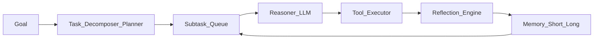

# Autonomous Cognitive Engine (ACE)
Autonomous Cognitive Engine for Deep Research and Long-Horizon Tasks.

## Problem
Long-horizon research and execution requires:
- breaking large goals into sub-tasks,
- using tools + retrieval,
- tracking progress across steps,
- self-evaluating outputs,
- preserving short-term + long-term memory,
- maintaining an audit trail for human oversight.

## Scope
### In-scope
- Multi-step decomposition (Planner)
- Web + internal knowledge retrieval (RAG)
- Long-term memory & episodic memory
- Modular execution layer (tools)
- Self-monitoring + reflection
- Continuous learning hooks (later)
- Audit trail + human oversight UI (later)

### Out-of-scope
- Human “research analyst” replacement
- Autonomous robotic control

## Target pipeline
